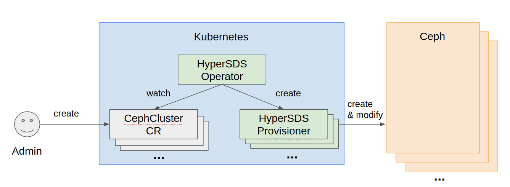
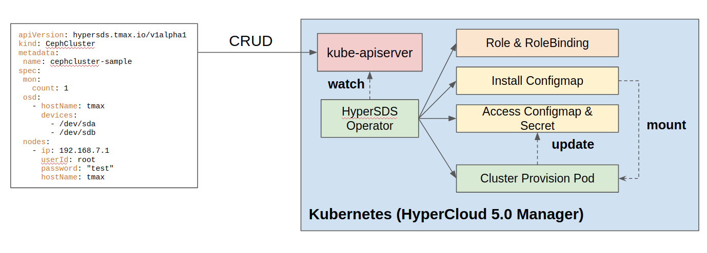

# Manage external ceph cluster in K8s

## Purpose

Hypersds-operator is designed to manage an external ceph cluster that is located outside of Kubernetes cluster. Having an external ceph cluster is useful for the following cases:
- share a ceph cluster with multiple k8s clusters
- use pre-existing ceph cluster installed with cephadm or ansible with k8s cluster
- isolate storage nodes from compute nodes

## User story



1. K8s Administrator prepares storage nodes and disks to install a ceph cluster

    - Check network connection between storage nodes and k8s cluster where to deploy hypersds-operator
    - Clean disks for OSD

2. K8s Administrator creates `CephCluster` custom resource (CR)

    Following is a sample yaml file.

    - Credentials to access each storage node is needed
    - Specify each disks to install OSD

    ``` yaml
    # cephcluster-cr.yaml
    apiVersion: hypersds.tmax.io/v1alpha1
    kind: CephCluster
    metadata:
      name: cephcluster-sample
    spec:
      mon:
        count: 1
      osd:
        - hostName: ubuntu-VirtualBox
          devices:
            - /dev/sdb
      nodes:
        - ip: 192.168.7.110
          userId: root
          password: "0000"
          hostName: ubuntu-VirtualBox
    ```

3. Wait for hypersds-operator to complete bootstrapping a ceph cluster

    Hypersds-operator watches a `CephCluster` CR and creates a hypersds-provisioner to bootstrap an external ceph cluster.

    ``` shell
    $ kubectl get cephcluster
    NAME       STATE
    cephcluster-sample  Completed
    ```

## Hypersds-operator Workflow



Hypersds-operator creates a role, rolebinding, two configmaps, a secret, and the hypersds-provisioner to managing an external ceph cluster.

### Role & RoleBinding

A role and rolebinding are for the hypersds-provisioner to update access configmap and a secret when the bootstrapping is done.

### Install ConfigMap

Install configmap is based on the `CephCluster` CR spec. It contains ceph configuration data for bootstrapping external ceph cluster including the number of ceph cluster monitor daemon and etc. 

### Access ConfigMap & Secret

Access configmap is for accessing the external ceph cluster when the bootstrap is completed. Hypersds-provisioner updates the configmap to store ceph cluster access information and the secret to store ceph keyring after the bootstrap.

### Hypersds-provisioner

Hypersds-provisioner directly accesses an external ceph cluster. Besides bootstrapping, additional features like adding osd hosts will be available soon. Watch [this repository](https://github.com/tmax-cloud/hypersds-provisioner) for more details.
